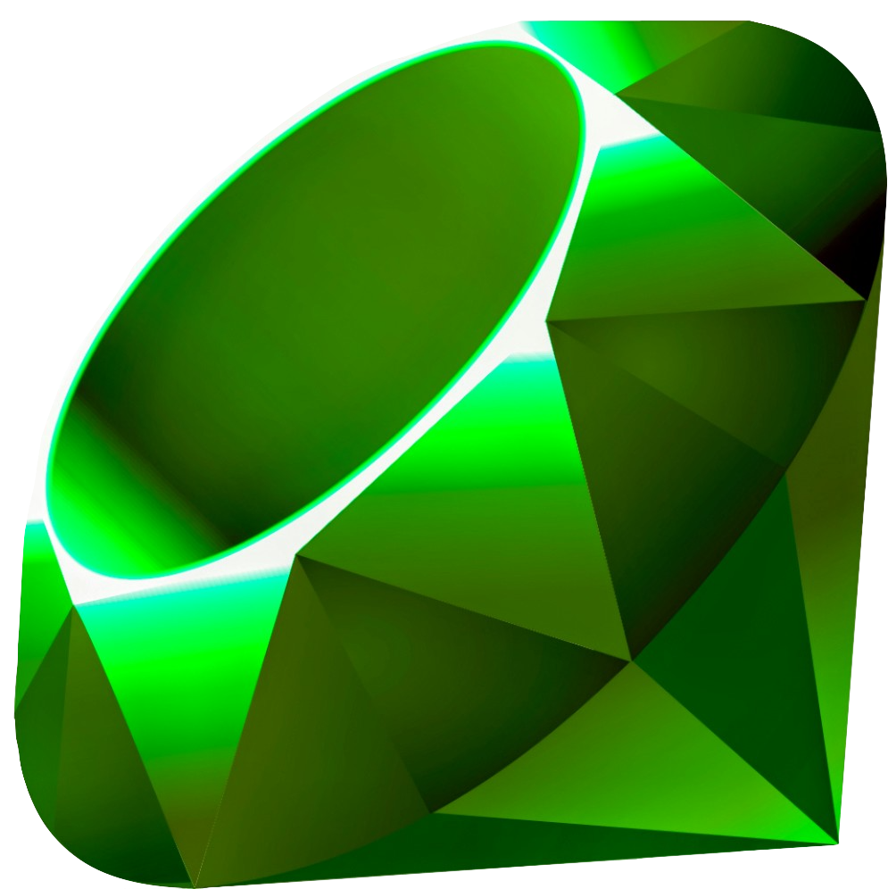

# README

${\textsf{\color{#50C878}emerald}}$ is a monolith template / proof of concept built with [Vue.js](https://vuejs.org/), [Vite](https://vitejs.dev/) (via [Vite Ruby](https://vite-ruby.netlify.app/)), and [Rails](https://rubyonrails.org/)

currently in use at [Launch Labs](https://github.com/launchlabs-ai) 🚀.
